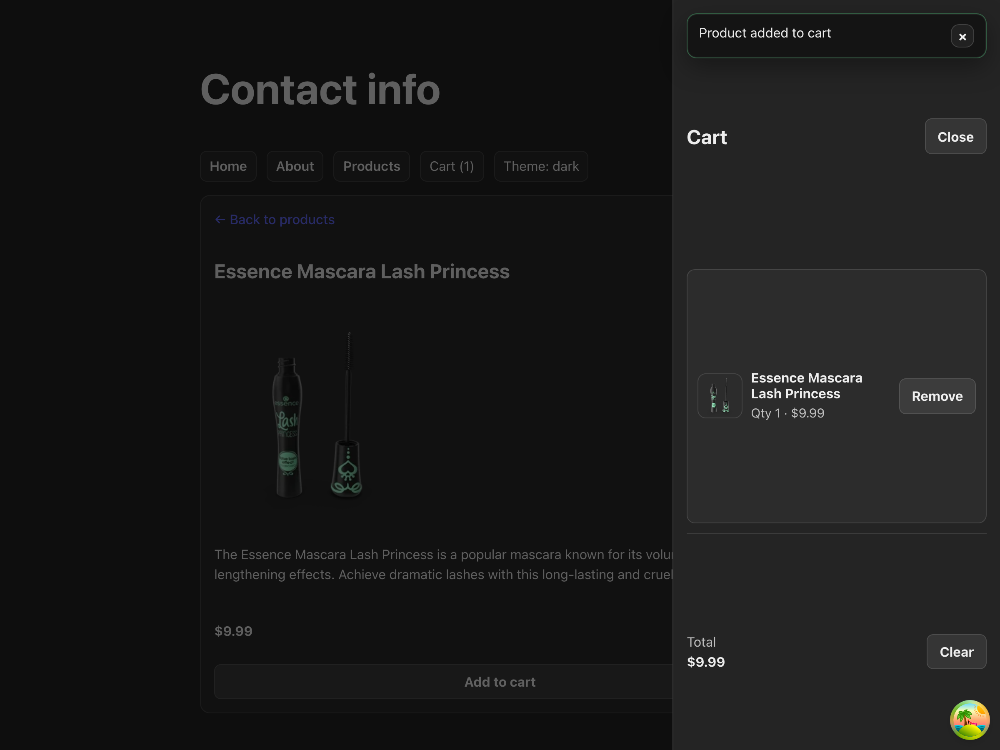
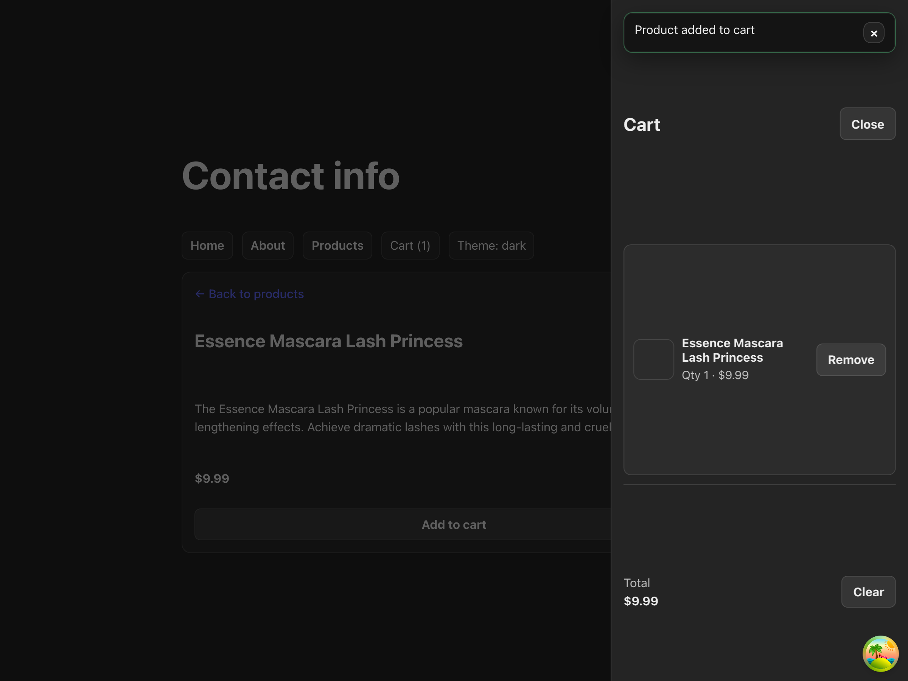
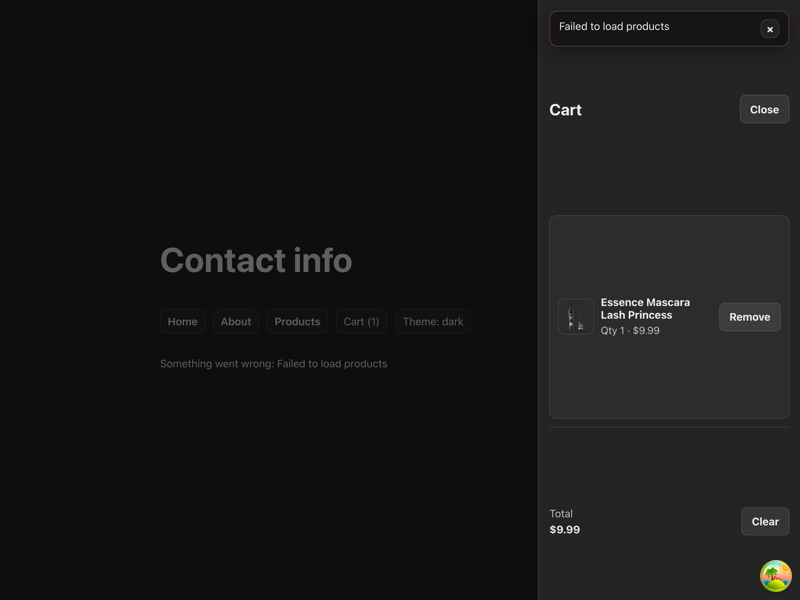

# PR Deliverables (Steps 1–6)

This PR includes the requested homework steps. Links point to the written deliverables, and screenshots are embedded below.

## Step 1 — State Inventory

- Document: `State Inventory.md`

## Step 2 — Context-Based Sidebar (Cart)

- Sidebar: Cart sidebar (right-side overlay)
- Opens from: header **Cart (n)** button
- Provider mounted at: `my-react-app/src/main.tsx` (wraps the app)

Screenshot (cart sidebar open):

## Step 3 — Persist Sidebar with a Custom localStorage Hook

- Notes + manual test checklist: `Step 3 - Sidebar Persistence.md`

## Step 4 — Global Toast Store (Zustand)

- Notes: `Step 4 - Toast Store.md`

Screenshot (two toasts: success + error):

## Step 5 — Connect Toasts to Real Events with TanStack Query

- Notes: `Step 5 - TanStack Toasts.md`

Screenshot (success toast after “Add to cart” mutation):

Screenshot (error toast + inline error UI for broken products query):

## Step 6 (Bonus A) — Theme Toggle (Zustand)

- Notes: `Bonus A - Theme Toggle.md`

Screenshot (light theme + cart sidebar):

