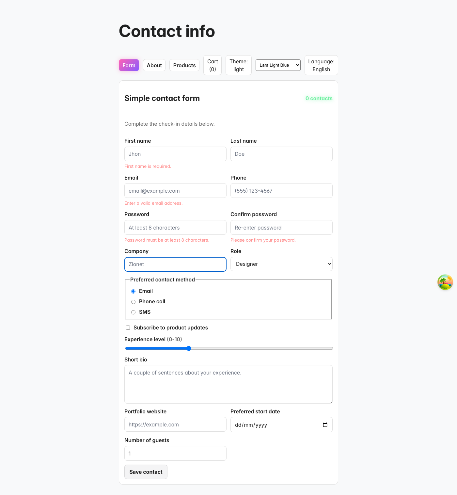
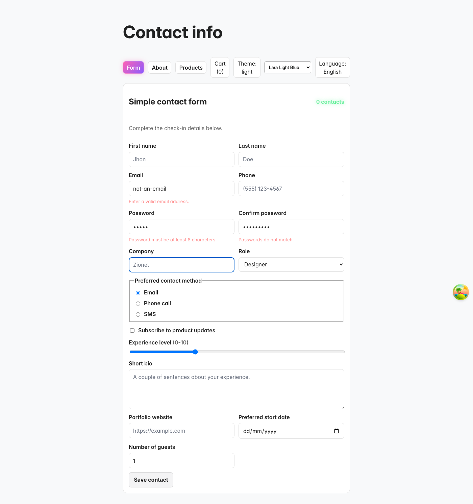
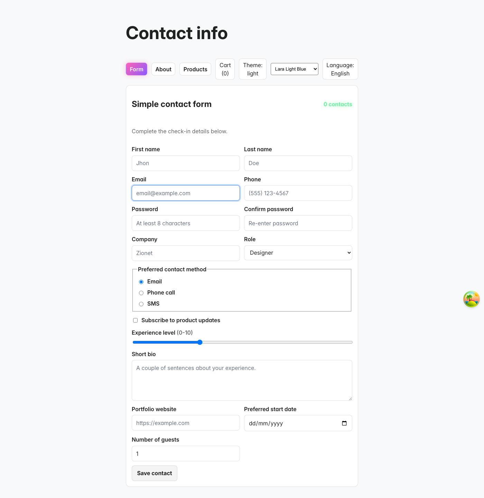
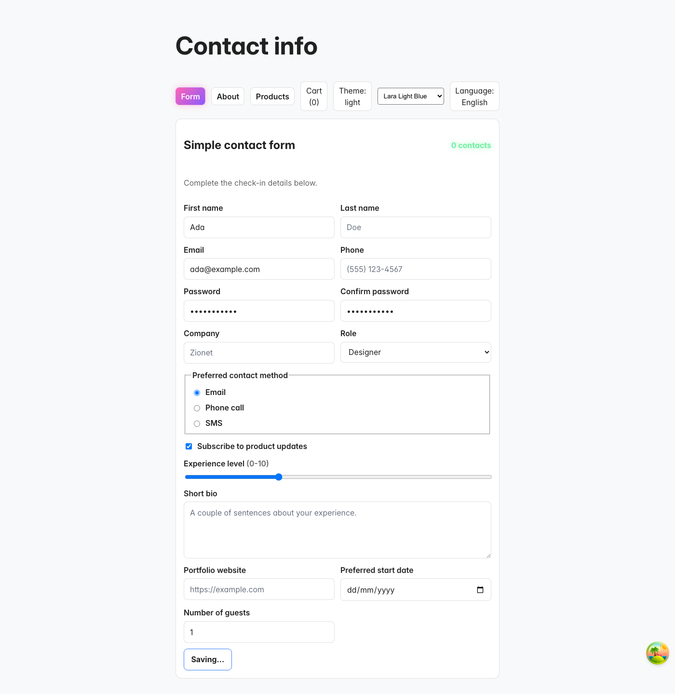
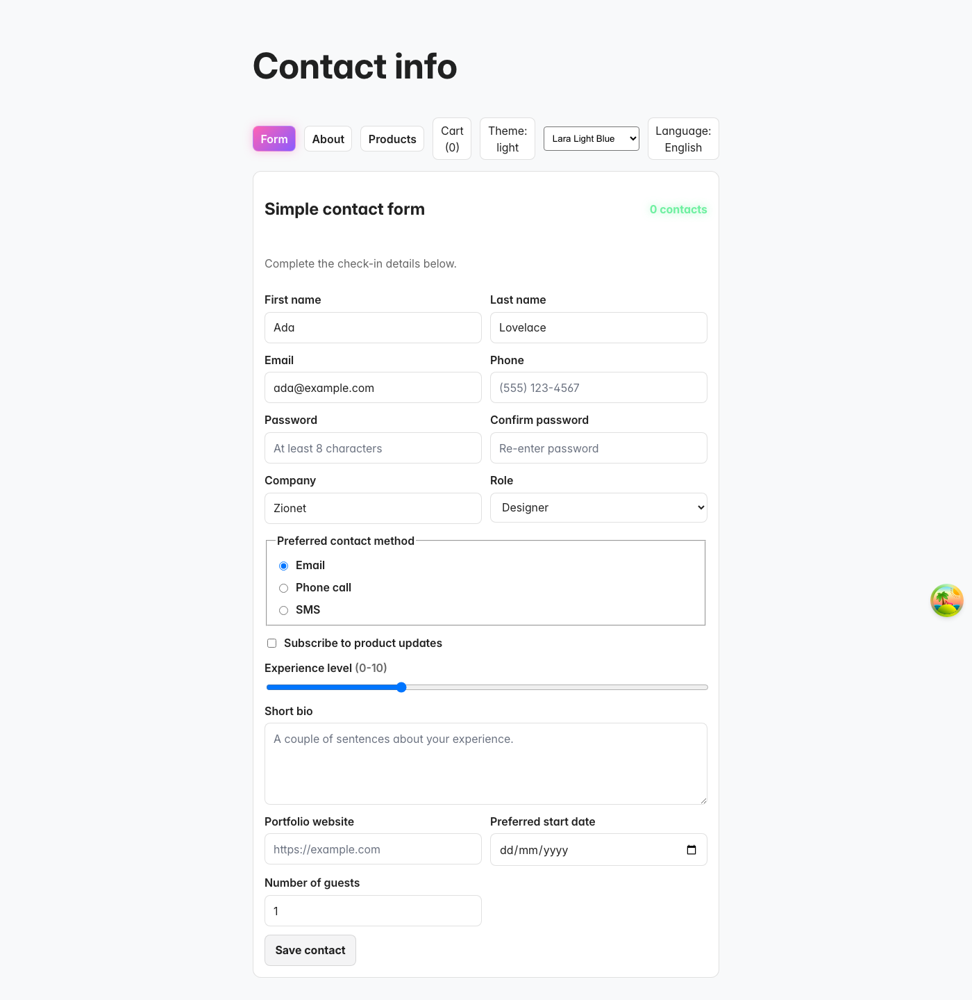

# Advanced 3 Implementation

## Implemented Tasks
1. Built a 10–15 field form using key control types (text, checkbox, radio, range, select, textarea, date, number).
2. Captured a screenshot of the form and saved it under `docs/advanced3/`.
3. Added accessible focus-visible styles to form controls without layout shift.
4. Added async submit simulation and console logging on submit.
5. Cached non-sensitive form data in localStorage and restored it on load.

## Screenshot

### Task 3 Validation

### Task 4 Error Display

### Task 5 Disabled Submit

### Task 6 Accessibility (Focus Visible)

### Task 7 Async Submit + Console Log

### Task 8 LocalStorage Persistence

